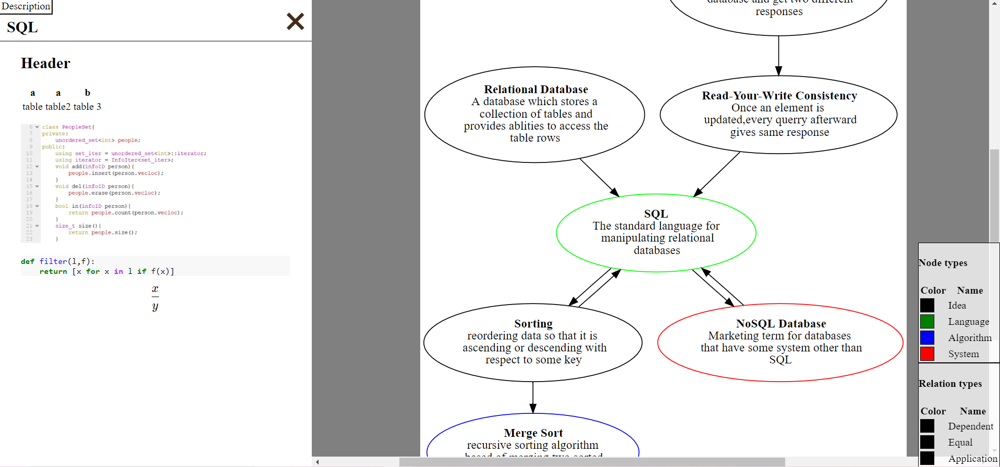

# graph-notes

Most notes are organized in a tree. Trees cannot describe the beautiful relationships between data. Graphs can. This tool encodes the references in an explicit graph, and to show the user some of the more important nearby connections of the graph as they move along it. Also allows for short, medium, and long form descriptions of subject, so you can dive down in as much detail as you would like.

### Install

This is a python project. However, to support its advanced markdown features, it also depends on node and ruby packages.

binary dependencies:

    sudo apt install graphviz, ruby, node, npm

ruby packages:

    sudo gem install rouge kramdown-math-katex

node packages:

    sudo npm install -g katex

Install python package

    pip install git+https://github.com/benblack769/graph-notes/

### Run

To generate the example website you can run

    generate-graph-notes examples/computer_science/ test_out

### Example output

To view the generated website you can run:

    python -m http.server

And once the server is up, you can go to [http://localhost:8000/test_out/#binary_search](http://localhost:8000/test_out/#binary_search) to view the result.

The result should look like this [(link to deployed example here)](https://benblack769.github.io/graph-notes/test_out/):

As you can see, the graph and key appear in the center of the screen, and any long form description appears on the left.
