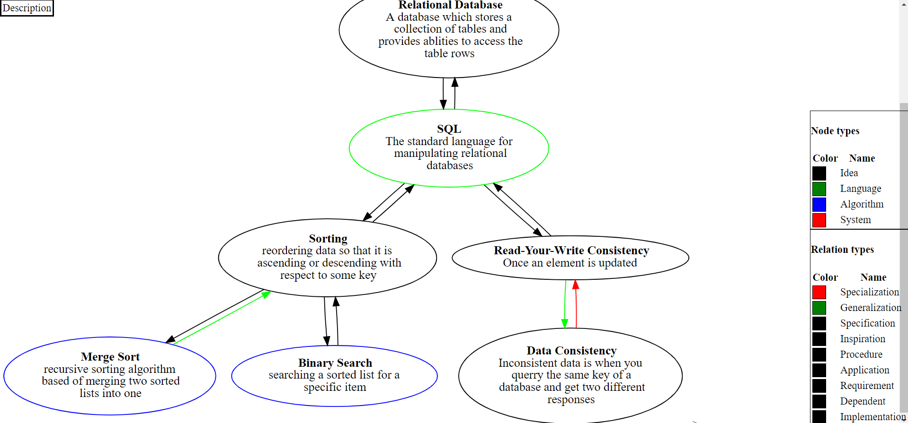
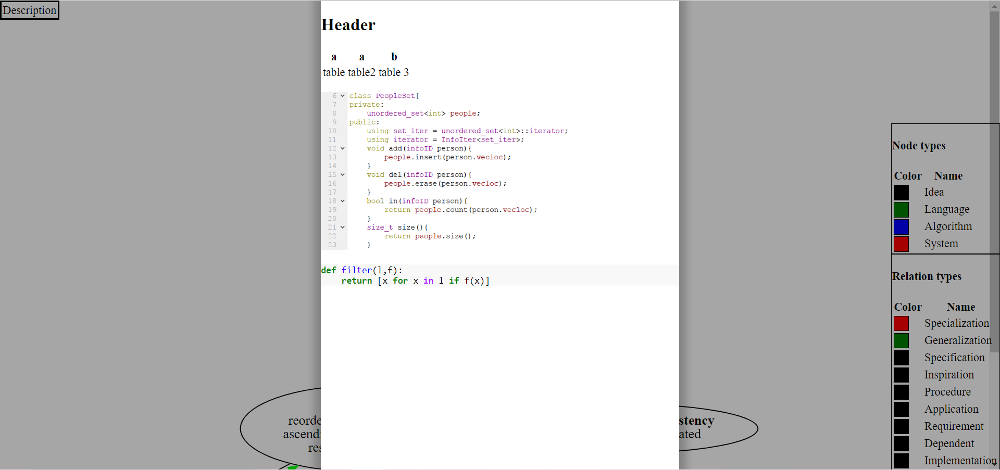

# interactive_info_graph
A HTML based interactive knowledge graph for communicating highly complex relationships.

Idea is that some subjects are so interrelated that they contain an enormous number of references. The idea is to encode these references in an explicit graph, and to show the user the local connections of the graph as they move along it. Also allows for long form writeups about specific subjects.

### Install

This is a python project. Depends on python 3.7. Also has a system dependency and one python package dependency:

binary dependencies:

    sudo apt install graphviz, ruby, node, npm

ruby packages:

    sudo gem install rouge, kramdown-math-katex

node packages:

    sudo npm install -g katex

### Example output

The example in `examples/computer_science/` looks like this:

The long form writeup is in markdown and has a number of features, looks like this:

